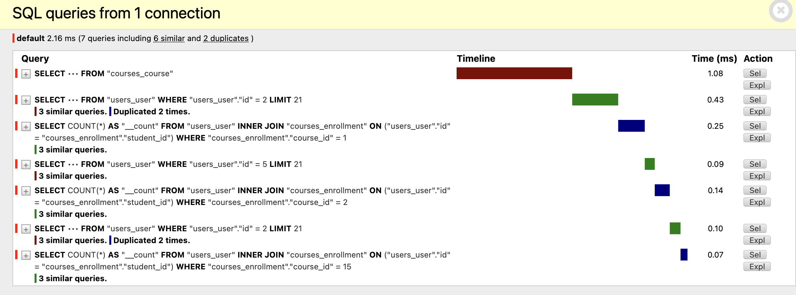
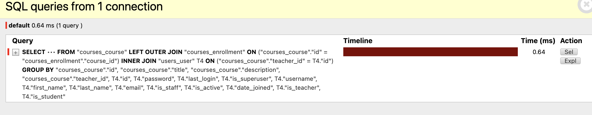
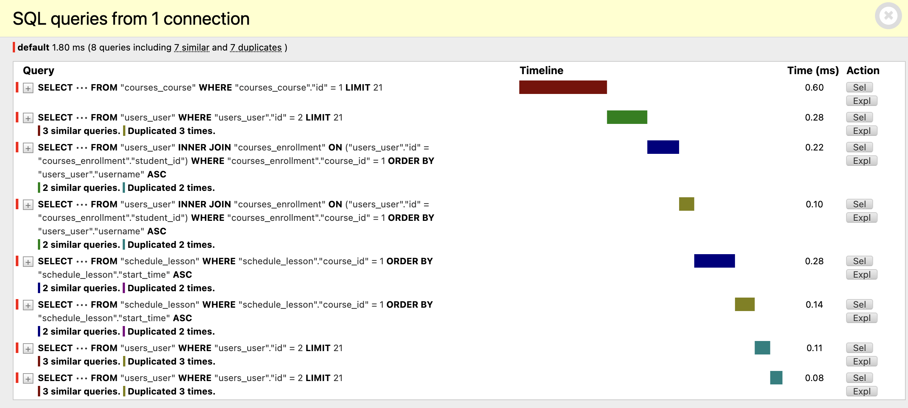
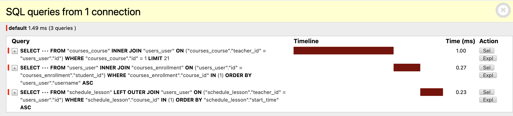

# Оптимизация страницы со списком всех курсов

URL страницы: http://127.0.0.1:8000/courses/

Количество запросов до оптимизации: 7

## Проблемы до оптимизации

- N+1 запросов на преподавателей курсов: для каждого курса выполнялся отдельный запрос на teacher
- N+1 запросов на подсчёт студентов: для каждого курса выполнялся отдельный COUNT запрос на таблицу courses_enrollment

## Решения

- Использовать select_related('teacher') для подгрузки всех преподавателей за один JOIN
- Использовать annotate(Count('students')) для подсчёта количества студентов без дополнительных запросов
- В шаблоне использовать новое поле num_students вместо course.students.count

Количество запросов после оптимизации: 1

# Оптимизация страницы с детальной информацией о каждом курсе

URL страницы: http://127.0.0.1:8000/courses/1/

Для примера взяли курс с id 1 (Python Professional). Можно подставить другие id.

Количество запросов до оптимизации: 8

## Проблемы до оптимизации
- N+1 запросов при выводе преподавателя курса
- N+1 запросов при выводе уроков и их преподавателей
- Отдельные запросы на студентов курса

## Решения
- Использовать select_related('teacher') для курса и уроков
- Использовать prefetch_related('students') для студентов
- Использовать Prefetch для уроков с select_related('teacher')

Количество запросов после оптимизации: 3

